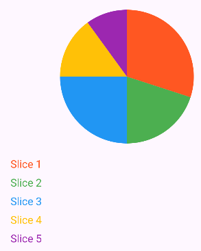
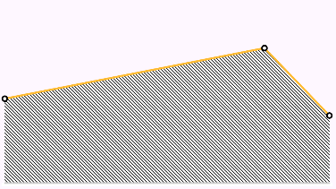
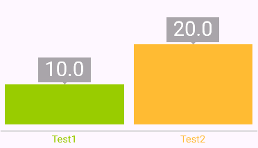
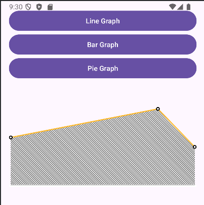
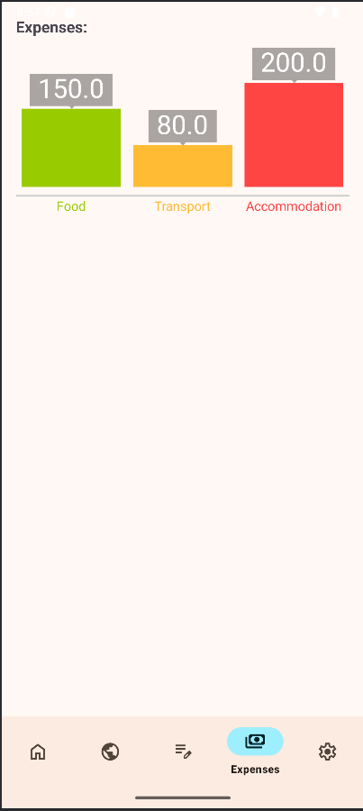

# 📱 Android Demo Aplikacija z HoloGraphLibrary

  
  
  
  


Ta projekt uporablja [HoloGraphLibrary](https://github.com/Androguide/HoloGraphLibrary) za prikaz grafov v Android aplikaciji. 📊

---

## 🎯 Zakaj HoloGraphLibrary?

HoloGraphLibrary je odprtokodna knjižnica, ki omogoča enostaven prikaz barvno privlačnih grafov (črtni, tortni, stolpčni).  

---

## ✅ **Prednosti**:
- 🧩 **Enostavna uporaba**: Enostavna integracija v projekte.
- 🎨 **Privlačen dizajn**: Grafi sledijo Holo Android dizajnu.
- 📚 **Dokumentacija**: Na voljo so primeri in osnovna navodila.
- 🆓 **Odprtokodna**: Brezplačna za uporabo in prilagajanje.

## ❌ **Slabosti**:
- 📉 **Zastarelost**: Zadnja posodobitev je iz leta 2017.
- 🚫 **Pomanjkanje aktivne skupnosti**: Brez nadaljnjega razvoja.
- 🔄 **Omejen nabor funkcij**: Ni primerna za kompleksne analize.

---

## 📊 Primeri uporabe:

### 🥧 Tortni graf:

Vizualizira deleže različnih kategorij v celoti.



```kotlin
val slices = listOf(
    PieSlice().apply {
        setColor(Color.parseColor("#FF5722"))
        setValue(30f)
        setTitle("Slice 1")
    },
    PieSlice().apply {
        setColor(Color.parseColor("#4CAF50"))
        setValue(20f)
        setTitle("Slice 2")
    },
    PieSlice().apply {
        setColor(Color.parseColor("#2196F3"))
        setValue(25f)
        setTitle("Slice 3")
    },
    PieSlice().apply {
        setColor(Color.parseColor("#FFC107"))
        setValue(15f)
        setTitle("Slice 4")
    },
    PieSlice().apply {
        setColor(Color.parseColor("#9C27B0"))
        setValue(10f)
        setTitle("Slice 5")
    }
)
```

---

### 📈 Črtni graf:

Prikazuje spremembe vrednosti skozi čas.



```kotlin
val line = Line().apply {
    addPoint(LinePoint().apply {
        setX(0f)
        setY(5f)
    })
    addPoint(LinePoint().apply {
        setX(8f)
        setY(8f)
    })
    addPoint(LinePoint().apply {
        setX(10f)
        setY(4f)
    })
    setColor(Color.parseColor("#FFBB33"))
}

lineGraph.addLine(line)
lineGraph.setRangeY(0f, 10f)
lineGraph.setLineToFill(0)
```

---

### 📊 Stolpčni graf:

Primerja vrednosti med različnimi kategorijami.



```kotlin
val points = ArrayList<Bar>()
val bar1 = Bar().apply {
    color = Color.parseColor("#99CC00")
    name = "Test1"
    value = 10f
}
val bar2 = Bar().apply {
    color = Color.parseColor("#FFBB33")
    name = "Test2"
    value = 20f
}
points.add(bar1)
points.add(bar2)

barGraph.bars = points
```

---

## 🛠️ MainActivity

Omogoča navigacijo med različnimi grafi.



```kotlin
class MainActivity : AppCompatActivity() {

    private lateinit var binding: ActivityMainBinding

    override fun onCreate(savedInstanceState: Bundle?) {
        super.onCreate(savedInstanceState)
        binding = ActivityMainBinding.inflate(layoutInflater)
        setContentView(binding.root)

        binding.btnLineGraph.setOnClickListener {
            findNavController(R.id.nav_host_fragment_content_main).navigate(R.id.lineGraphFragment)
        }

        binding.btnBarGraph.setOnClickListener {
            findNavController(R.id.nav_host_fragment_content_main).navigate(R.id.barGraphFragment)
        }

        binding.btnPieGraph.setOnClickListener {
            findNavController(R.id.nav_host_fragment_content_main).navigate(R.id.pieGraphFragment)
        }
    }
}
```

---

## 🔖 Licenca:
HoloGraphLibrary je objavljena pod licenco **Apache License 2.0**, kar omogoča:  
🔓 Prosto uporabo | 🔧 Spreminjanje | 📤 Distribucijo

---

## 📋 Projektna implementacija:

V projektu je uporabljena **HoloGraphLibrary** za prikaz grafa, ki prikazuje porabo denarja v različnih kategorijah.



